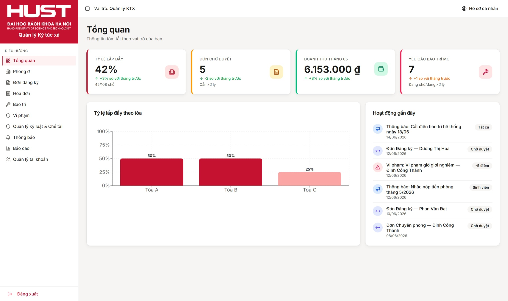
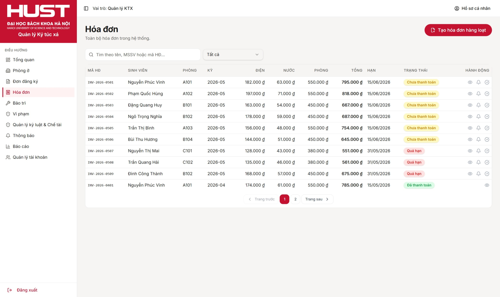
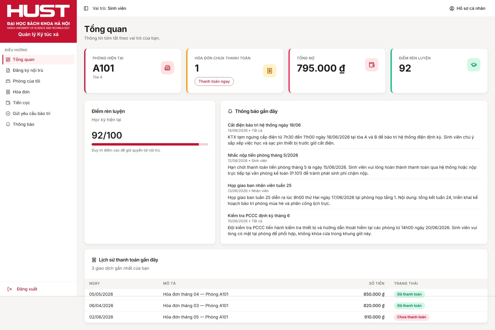
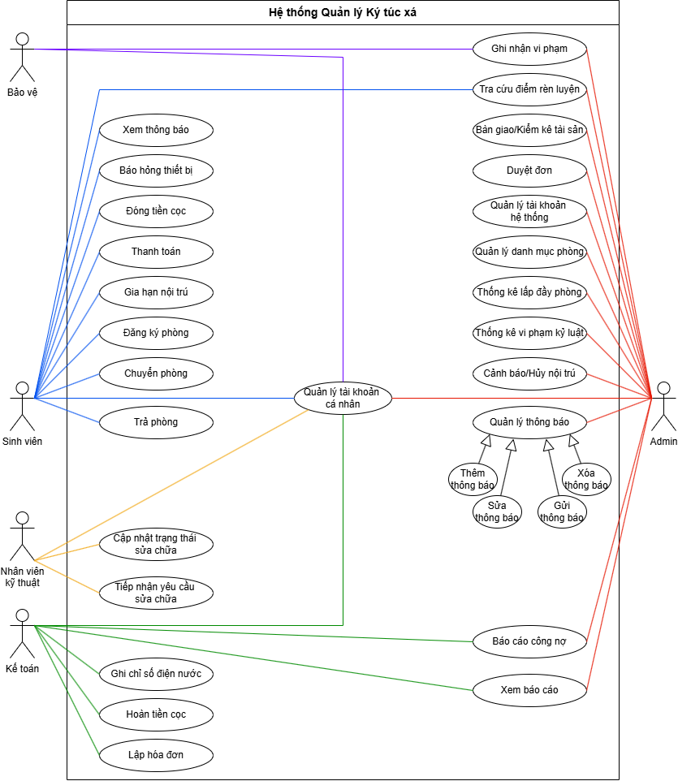
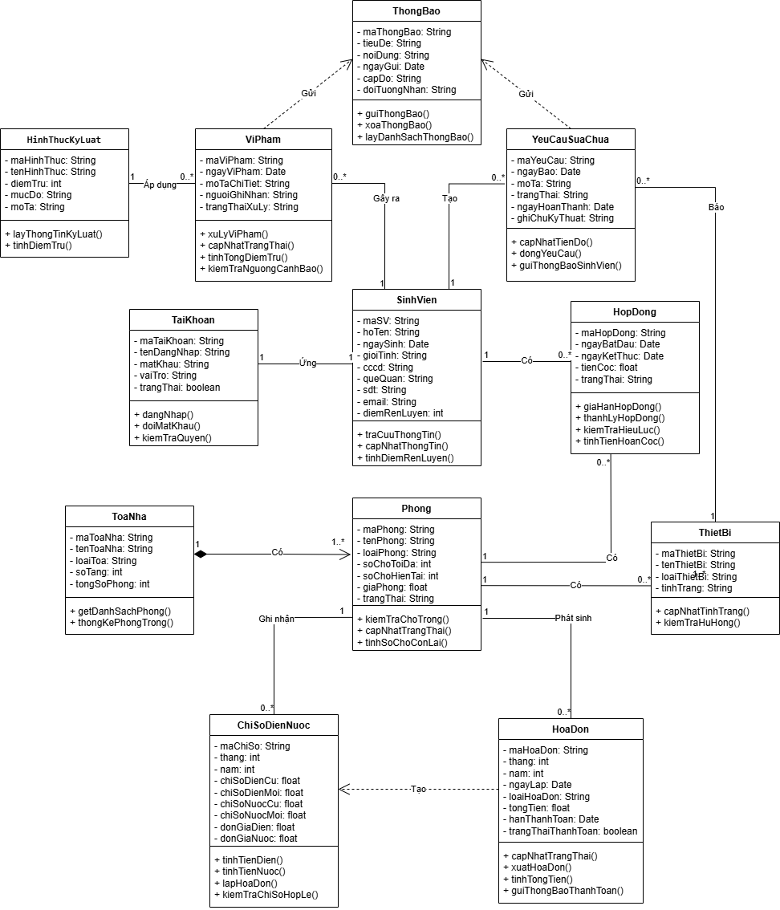

# Hệ Thống Quản Lý Ký Túc Xá Đại Học (KTX Manager)

> Đồ án môn học: Phân tích và Thiết kế Hệ thống (MI3120)  


**Hệ thống triển khai thực tế (Live Demo):** [https://mi3120-he-thong-quan-ly-ktx.vercel.app/](https://mi3120-he-thong-quan-ly-ktx.vercel.app/)

---

## Tổng Quan Dự Án

Hệ thống Quản lý Ký túc xá (KTX Manager) được xây dựng nhằm mục đích số hóa và tối ưu hóa toàn bộ quy trình vận hành lưu trú trong môi trường đại học. Ứng dụng cung cấp một giải pháp quản trị tập trung dựa trên cơ chế phân quyền vai trò nghiêm ngặt (RBAC), cho phép kết nối và xử lý luồng dữ liệu mượt mà giữa Ban quản lý, Kế toán, Bộ phận kỹ thuật, Đội ngũ bảo vệ và Sinh viên nội trú.

---

## Các Chức Năng Cốt Lõi (Theo Vai Trò)

### Ban Quản Lý (Admin)
- **Điều hành tổng quan:** Theo dõi trực quan tỷ lệ lấp đầy phòng, trạng thái hóa đơn công nợ và biểu đồ xu hướng vi phạm kỷ luật.
- **Quản lý lưu trú:** Cấu hình danh mục tòa/phòng, điều phối giường trống, duyệt tích hợp đơn Đăng ký / Gia hạn / Chuyển phòng / Trả phòng từ sinh viên.
- **Kiểm soát hệ thống:** Quản lý tài khoản nhân viên, cấu hình danh sách đen (Blacklist) và phát hành thông báo phân tầng đối tượng.

### Bộ Phận Kế Toán (Accountant)
- **Quản lý tiền cọc:** Theo dõi và thực hiện quy trình hoàn cọc tự động khi sinh viên thanh lý hợp đồng.
- **Điện nước số:** Nhập công tơ chỉ số điện nước định kỳ, hệ thống tự động ràng buộc logic và kích hoạt lệnh tính hóa đơn hàng loạt.
- **Quản lý công nợ:** Theo dõi trạng thái hóa đơn, gạch nợ tự động và xuất biên lai điện tử.

### Đội Ngũ Bảo Vệ (Security)
- **Giám sát kỷ luật:** Ghi nhận vi phạm tại chỗ, hệ thống tự động tính toán trừ điểm rèn luyện dựa trên biên bản số.
- **Kiểm soát cổng:** Tra cứu danh sách đen các sinh viên bị thu hồi tư cách nội trú để đảm bảo an ninh khu vực.

### Bộ Phận Kỹ Thuật (Technical)
- **Tiếp nhận sự cố:** Giám sát bảng Kanban theo dõi các đơn yêu cầu sửa chữa thiết bị từ phòng ở của sinh viên.
- **Cập nhật tiến độ:** Phân loại mức độ ưu tiên, cập nhật trạng thái xử lý và lưu vết ghi chú bảo trì.

### Phân Hệ Sinh Viên (Student)
- **Cổng dịch vụ:** Chủ động gửi yêu cầu nội trú, theo dõi lịch sử hóa đơn và thanh toán trực tuyến.
- **Tương tác số:** Báo hỏng thiết bị vật tư trong phòng, tra cứu điểm rèn luyện cá nhân và tiếp nhận trung tâm thông báo nội bộ.

---

## Giao Diện Hệ Thống

### Trang Tổng quan – Ban Quản lý (Admin Dashboard)

<p align="center">
  
</p>

### Trang Quản lý Tài chính – Bộ phận Kế toán

<p align="center">
  
</p>

### Cổng Dịch vụ – Phân hệ Sinh viên nội trú

<p align="center">
  
</p>

---

## Kiến Trúc Thư Mục Nguồn

Mã nguồn được tổ chức theo kiến trúc Single Page Application (SPA) hiện đại, phân tách mô-đun chức năng rõ ràng:

```text
src/
 ┣ components/     # Các UI Components tái sử dụng (Cấu hình trên shadcn/ui & Radix UI)
 ┣ routes/         # Hệ thống định tuyến và phân quyền màn hình (TanStack Router)
 ┣ hooks/          # Custom React hooks xử lý logic trạng thái độc lập
 ┣ mock/           # Mô phỏng kho dữ liệu tập trung và quản lý Global State (Zustand store)
 ┣ lib/            # Tiện ích mở rộng và cấu hình hệ thống (utils, định dạng tiền tệ/ngày tháng)
 ┗ assets/         # Tài nguyên tĩnh, ảnh thương hiệu và hệ thống CSS chủ đạo
```

---

## Phân Tích & Thiết Kế Hệ Thống (UML)

Sản phẩm được phát triển nghiêm túc dựa trên phương pháp luận Phân tích thiết kế hướng đối tượng (OOAD) học tập tại môn học MI3120, bao gồm các artifact thiết kế cốt lõi trong báo cáo chính thức:

* **Sơ đồ Use Case Toàn cảnh:** Khái quát hóa toàn bộ 34 nghiệp vụ hệ thống.
* **Sơ đồ Tuần tự (Sequence Diagram):** Mô hình hóa chi tiết luồng xử lý tương tranh (tranh chấp chỗ trống, xử lý đồng thời, quyết toán tài chính).
* **Sơ đồ Lớp tĩnh (Class Diagram):** Chuẩn hóa cấu trúc thực thể quản lý KTX.
* **Biểu đồ Hoạt động (Activity Diagram):** Chi tiết hóa luồng xử lý nghiệp vụ đơn và hóa đơn điện nước.

### Sơ đồ Use Case toàn cảnh hệ thống

<p align="center">
  
</p>

### Sơ đồ Lớp tĩnh (Class Diagram)

<p align="center">
  
</p>

---

## Công Nghệ Áp Dụng

* **Ngôn ngữ & Thư viện lõi:** React 19, TypeScript, Vite (Tối ưu hóa tốc độ build)
* **Quản lý trạng thái:** Zustand (Quản lý bộ nhớ tạm tập trung cho các vai trò)
* **Giao diện & UI/UX:** Tailwind CSS (Cấu hình đồng bộ hệ màu thương hiệu HUST `#C41230`), `shadcn/ui`, Lucide Icons
* **Trực quan hóa dữ liệu:** Recharts (Vẽ đồ thị thống kê doanh thu và cơ cấu vi phạm)
* **Triển khai hạ tầng:** Vercel (Tích hợp luồng triển khai tự động hóa)

> **Lưu ý:** Dự án hiện tại đang sử dụng Mock Data lớp dữ liệu tạm trên bộ nhớ Client phục vụ cho mục đích Demo thẩm định luồng nghiệp vụ. Hệ thống đã sẵn sàng kiến trúc để kết nối với các hệ thống RESTful API Backend ở giai đoạn tiếp theo.

---

## Khởi Chạy Ứng Dụng Tại Địa Phương

Để cài đặt và chạy thử mã nguồn trên máy cá nhân, yêu cầu máy đã cài sẵn **Node.js** (Khuyến nghị bản v18 trở lên). Thực hiện các lệnh sau tại Terminal:

```bash
# 1. Sao chép kho lưu trữ mã nguồn
git clone https://github.com/latdat/MI3120_Dormitory_Management_System.git

# 2. Di chuyển vào thư mục dự án và cài đặt gói thư viện phụ thuộc
cd MI3120_Dormitory_Management_System
npm install

# 3. Khởi chạy máy chủ phát triển local
npm run dev
```

Sau khi chạy lệnh, truy cập địa chỉ hiển thị trên Terminal (Mặc định là `http://localhost:5173`) để trải nghiệm hệ thống.

---

## Tài Khoản Khảo Sát Hệ Thống (Test Credentials)

Hệ thống sử dụng chung một cơ chế **Mật khẩu mặc định: `123456`**. Thầy cô và người kiểm thử có thể sử dụng các tên đăng nhập dưới đây để trực tiếp trải nghiệm sự phân tách quyền hạn giữa các vai trò trên giao diện:

| Tên Đăng Nhập (Username) | Vai Trò Hệ Thống (Role) | Phạm Vi Giao Diện Hiển Thị |
| --- | --- | --- |
| `admin` | Ban Quản Lý KTX | Toàn quyền cấu hình phòng, duyệt đơn, xem báo cáo, quản lý tài khoản. |
| `sinhvien` | Sinh Viên Nội Trú | Xem thông tin phòng, lịch sử hóa đơn cá nhân, form báo hỏng, bảng tin. |
| `ketoan` | Bộ Phận Kế Toán | Bảng theo dõi chỉ số điện nước, bảng tiền cọc và quản lý hóa đơn. |
| `kythuat` | Nhân Viên Kỹ Thuật | Bảng Kanban xử lý sự cố vật tư phòng ở. |
| `baove` | Nhân Viên Bảo Vệ | Form ghi nhận vi phạm kỷ luật và danh sách đen kiểm soát cổng. |

---
